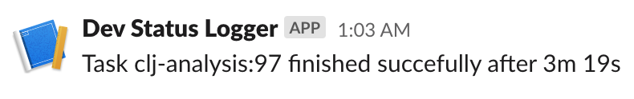
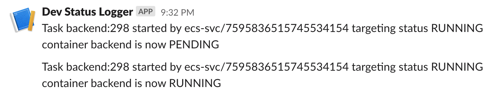

# ecs-status-reporter

Terraform module for a Lambda function that reports ECS service status to Slack channel.

The Lambda function is written in Clojure and run by Babashka using [babashka-lambda-layer](https://github.com/dainiusjocas/babashka-lambda-layer).

Currently state changes started by events rules report the task duration, other states are reported as-is.

## Usage

First, request AWS serverlessrepo to create a S3 object that you can use to publish the Babashka layer into your AWS
account. When this procedure is done via the AWS Console, a Cloudformation stack is generated, which is used to deploy
the layer onto your account. We can simulate this with the following:

    export CF_TEMPLATE_URL=$(aws serverlessrepo create-cloud-formation-template --application-id arn:aws:serverlessrepo:us-east-1:209523798522:applications/babashka-runtime --query TemplateUrl --out text)
    
    bb '(let [{:keys [Bucket Key]} (-> (System/getenv "CLOUDFORMATION_TEMPLATE_URL") curl/get :body yaml/parse-string :Resources :BabashkaLayer :Properties :ContentUri)] (println "Bucket:" Bucket "\nKey:" Key))'
    Bucket: awsserverlessrepo-changesets-xxxyyy
    Key: <your account id>/arn:aws:serverlessrepo:us-east-1:209523798522:applications-babashka-runtime-versions-0.1.0/051e10fc-afe2-40ce-ab64-8a6bec39e3b2

Then, add the following into your `.tf` file:

```hcl
module "ecs_status_reporter" {
  # Use ref=<git hash> to pick a specific version
  source = "git@github.com:viesti/ecs-status-reporter?ref=9e2a5d6e3d85e0f9091c1ba91a387eff0b05269e"

  bot_name = "ecs-status"
  slack_webhook_url = "..."

  layer_s3_bucket = <Bucket from above>
  layer_s3_object = <Key from above>
}
```

## Examples

Scheduled task report



Service report


